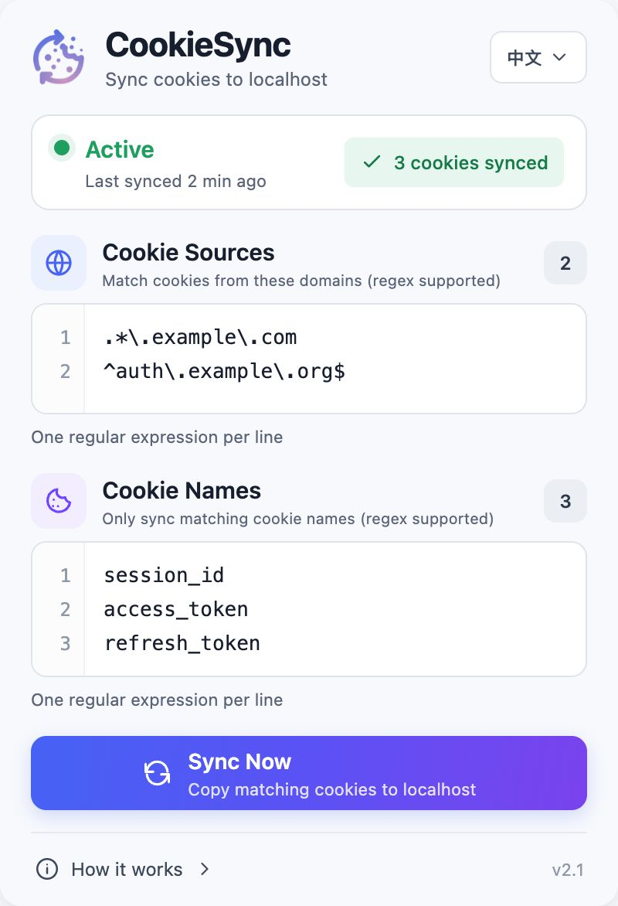

  

<h1 align="center">CookieSync</h1>

  将指定远程域名的 Cookie 同步到 <code>http://localhost</code>，服务于本地开发。

  <a href="README.md">English</a> · 简体中文

> [!IMPORTANT]
> 本仓库 Fork 自 [roelnoten/cookiesync](https://github.com/roelnoten/cookiesync)。CookieSync 的诞生离不开 [Roel Noten](https://github.com/roelnoten) 的原创工作，感谢他创建并开源了这个项目。完整说明请参阅[致谢与 Fork 来源](#致谢与-fork-来源)。

## 项目简介

CookieSync 是一个面向开发者的 Chrome 扩展，用于解决 localhost 应用需要使用远程服务 Cookie 的问题。

典型场景是登录认证：生产环境中的应用与认证服务处于同一域名体系，可以正常使用认证服务写入的 Cookie；但前端在 localhost 运行时，无法直接读取远程域名下的 Cookie。CookieSync 会根据你配置的来源域名正则和 Cookie 名称正则进行筛选，并为 <code>http://localhost</code> 创建对应 Cookie。

扩展既支持匹配 Cookie 发生变化时自动同步，也支持通过**立即同步**手动扫描现有 Cookie。

## 界面预览

  

## 功能特性

- 支持多条 Cookie 来源域名正则，每行一条。
- 支持多条 Cookie 名称正则，每行一条。
- 匹配的 Cookie 新增或更新时自动同步。
- 一键手动同步当前所有匹配的 Cookie。
- 持久展示同步状态、成功数量和失败数量。
- 支持英文与简体中文界面。
- 使用 Chrome 扩展本地存储保存配置。
- 基于 Manifest V3 Service Worker。

## 工作原理

~~~text
远程网站新增或更新 Cookie
             │
             ▼
     来源域名正则是否匹配
             │
             ▼
    Cookie 名称正则是否匹配
             │
             ▼
  为 http://localhost 创建 Cookie
~~~

CookieSync 会忽略已经属于 <code>localhost</code> 的 Cookie，避免触发循环同步。

复制 Cookie 时，当前实现会：

- 将目标设置为 <code>http://localhost</code>；
- 尽可能保留名称、值、路径、HTTP-only 标记和过期时间；
- 创建仅属于 localhost 的 Host-only Cookie；
- 因目标使用 HTTP，关闭 Secure 标记；
- 为兼容 localhost，将 <code>SameSite=None</code> 转换为 <code>Lax</code>。

## 从源码安装

CookieSync 当前以 Chrome 未打包扩展的方式提供使用说明。

1. 克隆本仓库：

   ~~~bash
   git clone https://github.com/wilsonyiyi/cookiesync.git
   cd cookiesync
   ~~~

2. 在 Chrome 中打开 <code>chrome://extensions</code>。
3. 开启右上角的**开发者模式**。
4. 点击**加载已解压的扩展程序**。
5. 选择本仓库中的 <code>chrome</code> 目录。
6. 如果需要快速访问，可在 Chrome 扩展菜单中固定 CookieSync。

拉取或修改源码后，请回到 <code>chrome://extensions</code>，点击 CookieSync 卡片上的**重新加载**。

## 配置 CookieSync

打开扩展 Popup，分别配置两组过滤条件。

### Cookie 来源

每行填写一条兼容 JavaScript 的正则表达式。Cookie 的来源域名至少匹配其中一条才会继续处理。

~~~regex
.*\.example\.com
^auth\.example\.org$
~~~

### Cookie 名称

每行填写一条兼容 JavaScript 的正则表达式。Cookie 名称至少匹配其中一条才会被同步。

~~~regex
^session_id$
^access_token$
^refresh_token$
~~~

修改会立即保存。无效正则会导致匹配失败，复杂表达式建议先单独验证。

### 手动同步

点击**立即同步**后，CookieSync 会扫描扩展当前有权访问的全部 Cookie。状态卡会展示操作是否成功，以及成功复制的 Cookie 数量。

之后匹配 Cookie 发生变化时，后台自动同步仍会继续生效。

## 状态说明

| 状态 | 含义 |
|---|---|
| 准备就绪 | 尚未记录手动同步结果。 |
| 同步中 | 正在扫描并复制匹配的 Cookie。 |
| 运行中 | 最近一次手动同步已成功完成。 |
| 同步失败 | 至少一个匹配 Cookie 复制失败，或扩展运行时发生错误。 |

## 权限与隐私

CookieSync 需要较宽的 Cookie 访问范围，以便用户自行配置任意来源域名。

| 权限 | 用途 |
|---|---|
| <code>cookies</code> | 读取匹配 Cookie，并为 localhost 创建副本。 |
| <code>storage</code> | 在本地保存正则配置、语言偏好和最近同步状态。 |
| <code>*://*/*</code> 主机权限 | 允许通过正则配置域名，而不是在代码中写死站点列表。 |

当前代码不会把 Cookie 或配置上传到远程服务，匹配和复制均在 Chrome 扩展内部完成。Cookie 仍可能包含敏感认证信息，因此建议安装前审查源码、尽可能缩小正则匹配范围，并只在可信的浏览器配置文件中使用本扩展。

## 常见问题

### Cookie 没有同步

请依次确认：

1. Cookie 域名至少匹配一条 **Cookie 来源**正则。
2. Cookie 名称至少匹配一条 **Cookie 名称**正则。
3. 每条表达式都符合 JavaScript 正则语法。
4. 修改源码后已经重新加载扩展。
5. CookieSync 拥有来源网站的访问权限。

修正后点击**立即同步**重新尝试。

### 查看 Service Worker 日志

1. 打开 <code>chrome://extensions</code>。
2. 找到 CookieSync。
3. 打开卡片中的 **Service Worker** 检查链接。
4. 在控制台中查看成功复制和复制失败的 Cookie 数量。

### localhost 仍然无法使用 Cookie

请确认应用运行在 <code>http://localhost</code>。<code>127.0.0.1</code> 等其他主机名与 localhost 不属于同一个 Cookie 域。

浏览器 Cookie 策略也可能影响最终行为。CookieSync 会针对 HTTP localhost 调整 Secure 和 SameSite 属性，不会原样复制远程 Cookie 的全部属性。

## 开发说明

Chrome 扩展源码位于 [<code>chrome</code>](chrome) 目录：

| 文件 | 用途 |
|---|---|
| <code>manifest.json</code> | Manifest V3 元数据与权限声明。 |
| <code>service_worker.js</code> | Cookie 匹配与同步逻辑。 |
| <code>popup.html</code> | Popup 页面结构。 |
| <code>popup.js</code> | Popup 状态、多语言、配置与手动同步。 |
| <code>tokens.css</code> | Design Token。 |
| <code>popup.css</code> | Popup 页面样式。 |

项目没有构建步骤。开发时直接加载 <code>chrome</code> 目录，修改后重新加载扩展即可。

Popup 右下角会显示当前版本。运行时从 <code>chrome/manifest.json</code> 读取。CI 在发版时会同步 <code>package.json</code>、manifest 和 Popup 中的版本号。

### 发布

推送到 <code>main</code> 后，GitHub Actions 会自动发版。<code>semantic-release</code> 会检查距上一 tag 的 [Conventional Commits](https://www.conventionalcommits.org/)，只有包含可发版变更时才会发布：

| Commit 类型 | 版本变化 |
|---|---|
| <code>fix:</code> | patch（<code>2.1.0</code> → <code>2.1.1</code>） |
| <code>feat:</code> | minor（<code>2.1.0</code> → <code>2.2.0</code>） |
| <code>BREAKING CHANGE</code> 或 <code>feat!:</code> | major（<code>2.1.0</code> → <code>3.0.0</code>） |

发版会更新 <code>CHANGELOG.md</code>，把版本同步到 <code>chrome/manifest.json</code> 和 Popup，打 git tag，并把 <code>cookiesync-chrome.zip</code> 上传到 GitHub Release。<code>docs:</code>、<code>chore:</code> 这类 commit 不会发布新版本。

本地预览下一版本、不实际发布：

~~~bash
npm install
npm run release:dry
~~~

### 打包扩展

在仓库根目录执行：

~~~bash
npm run package
~~~

## 致谢与 Fork 来源

本仓库保留并扩展了上游项目的工作：

- 原始项目：[roelnoten/cookiesync](https://github.com/roelnoten/cookiesync)
- 原作者：[Roel Noten](https://github.com/roelnoten)
- Manifest V3 升级贡献者：[Erik Bessegato](https://github.com/erik-bessegato)
- 当前 Fork：[wilsonyiyi/cookiesync](https://github.com/wilsonyiyi/cookiesync)

诚挚感谢 Roel Noten 创建 CookieSync 并将它分享给社区，也感谢 Erik Bessegato 完成后来合入上游项目的 Manifest V3 升级。本 Fork 在他们工作的基础上增加了多正则匹配、手动同步、同步状态反馈、多语言界面和新版 Popup 设计。

## 版本历史

- **1.4** — 首个发布版本。
- **2.0** — 迁移到 Manifest V3，并将后台脚本改为 Service Worker；感谢 Erik Bessegato 的贡献。
- **2.1** — 移除 <code>declarativeNetRequest</code> 与 <code>declarativeNetRequestFeedback</code> 权限。
- **当前 Fork** — 新增多来源域名正则、手动同步、双语界面、持久化状态和新版 Popup。

## 许可证

本项目按照 [LICENSE](LICENSE) 中的条款发布。
